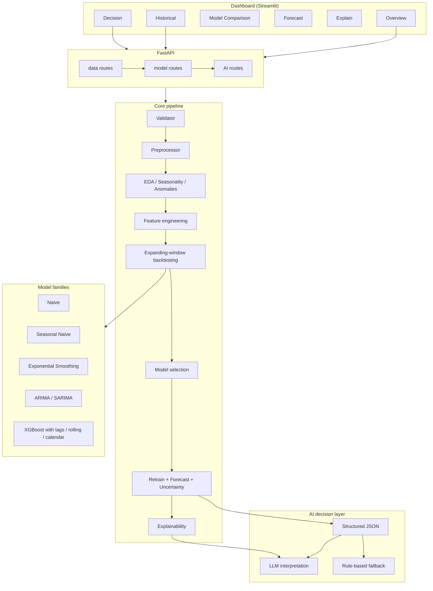

# AI-Powered Forecasting & Decision Intelligence Engine

> **Historical data → Forecast → Evaluate → Explain → Recommend**

A production-oriented, domain-agnostic forecasting system that takes messy
temporal business data, builds statistically sound forecasting models,
validates them with time-series backtesting, quantifies uncertainty, explains
the drivers behind predictions, and converts the result into actionable
business decisions — with an optional LLM interpretation layer.

---

## Why this project exists

There is a large gap between *forecasting a number* and *building a decision
system around a forecast*.

Forecasting a number answers one question: *"what value should we expect?"*

A decision system answers five questions a decision-maker actually asks:

1. **What is happening?** — data validation and exploratory analysis
2. **What is expected?** — a forecast from a model chosen on *validated* performance
3. **How confident are we?** — prediction intervals that widen with horizon
4. **Why is it happening?** — drivers and feature importance, never causality
5. **What should we do?** — a decision brief grounded strictly in the numbers

This project demonstrates the full chain. No single component is impressive in
isolation; the system is built to be **correct first**:


```
Problem
   ↓
Data
   ↓
Statistical reasoning
   ↓
Modeling
   ↓
Validation
   ↓
Uncertainty
   ↓
Explainability
   ↓
AI interpretation
   ↓
Decision
```

---

## Architecture

```
┌─────────────────────────────────────────────────────────────────────┐
│                          Dashboard (Streamlit)                      │
│   Overview │ Historical │ Models │ Forecast │ Explain │ Decision    │
└───────────────────────────────┬─────────────────────────────────────┘
                                │
                                ▼
┌─────────────────────────────────────────────────────────────────────┐
│                          FastAPI layer                              │
│   /data/upload ─ /data/validate ─ /data/explore                    │
│   /models/train ─ /models/evaluate ─ /models/forecast              │
│   /explain ─ /recommend                                          │
└───────────────┬─────────────────────────────────────────────────────┘
                │
┌───────────────▼─────────────────────────────────────────────────────┐
│                        Core pipeline                                │
│  Loader → Validator → Preprocessor → EDA / Seasonality / Anomalies │
│        → Feature engineering (calendar / lag / rolling)             │
│        → Backtesting (expanding window)                             │
│        → Model selection → Retrain → Forecast + uncertainty         │
│        → Explainability (drivers / feature importance / SHAP)       │
└───────────────┬─────────────────────────────────────────────────────┘
                │            │                        │
┌───────────────▼───┐  ┌─────▼─────┐          ┌──────▼───────────────────┐
│ Naive / Seasonal  │  │ ETS       │          │ AI decision layer        │
│ Naive (baselines) │  │ ARIMA/    │          │ structured JSON → prompt │
│                   │  │ SARIMA    │          │ → business brief          │
│ (point helper)    │  │           │          │ (optional, graceful       │
│                   │  │ XGBoost   │          │  fallback without LLM)    │
└───────────────────┘  └───────────┘          └──────────────────────────┘
```



---

## Getting started

### Prerequisites

- Python 3.11+ (developed and verified on 3.13)
- Recommended: a virtual environment

### Installation

```bash
git clone <your-repo-url> forecasting-engine
cd forecasting-engine

python -m venv .venv
.venv\Scripts\activate          # Windows
# source .venv/bin/activate     # macOS / Linux

pip install -r requirements.txt
```

### Configuration

Copy the example environment file and set values as needed:

```bash
cp .env.example .env
```

**The AI/LLM layer is OFF by default.** The application runs entirely on
deterministic, rule-based decision briefs with no credentials required. To
opt in to LLM interpretation later, set both `AI_ENABLED=true` and an
`OPENAI_API_KEY` in `.env`. Even then, the LLM only interprets structured
statistics — it never performs forecasting.

### Run the API

```bash
uvicorn app.main:app --reload
# API:   http://127.0.0.1:8000
# Docs:  http://127.0.0.1:8000/docs
```

The bundled sample dataset is generated automatically on first startup
(`data/sample/business_demand.csv`, 1 095 days of trend + seasonality + noise +
anomalies, seed `42`).

### Run the dashboard

```bash
streamlit run dashboard/app.py
# Dashboard: http://127.0.0.1:8501
```

### Run the tests

```bash
pytest
```

### Run with Docker

```bash
docker-compose up --build
# API:   http://127.0.0.1:8000
# Dash:  http://127.0.0.1:8501
```

---

## Data pipeline

1. **Upload** — CSV/XLSX selected or uploaded; date and target columns are
   inferred or configured.
2. **Validate** — schema checks (required columns, types, duplicates),
   temporal-integrity checks (missing dates, irregular frequency, gaps,
   duplicate timestamps, ordering), and target-quality checks (missing values,
   negatives, outliers, constant series). Produces a **Data Quality Score**
   and an explicit issue list. **Nothing is silently modified:** all
   transformations are reported.
3. **Preprocess** — parse and sort dates, deduplicate timestamps, coerce the
   target to numeric, drop rows with unusable values. Every action is recorded.
4. **Explore** — automated EDA: trend direction and significance, seasonal
   period detection, volatility trend, anomaly detection, and decomposition.
5. **Feature engineer** — calendar features, lag features, and rolling
   statistics. All features are computed from the past only.
6. **Backtest** — expanding-window validation across several folds.
7. **Select** — the best model by a configurable metric (sMAPE by default).
8. **Retrain & forecast** — retrain the winner on the full history and produce
   a point forecast with prediction intervals for the chosen horizon.
9. **Explain** — drivers and feature importance.
10. **Recommend** — a decision brief from a structured summary (LLM or
    rule-based).

---

## Forecasting models

| Model | Family | Notes |
|---|---|---|
| `naive` | Baseline | Forecast = last observed value. The minimum benchmark. |
| `seasonal_naive` | Baseline | Forecast = value one detected season back. |
| `ets` | Statistical | Exponential smoothing (Holt-Winters). Seasonal component chosen automatically when 3+ cycles exist. |
| `arima` | Statistical | ARIMA/SARIMA with automatic order selection by AIC over a curated grid, time-budgeted for practical backtests. |
| `xgboost` | ML | Gradient boosting on lag, rolling, and calendar features with recursive multi-step prediction. |

**Why multiple models?** No single family dominates across all datasets.
Simple models often beat complex ones on short or noisy series. The
backtesting stage is the arbiter — the project deliberately demonstrates that
the naive baseline can win.

---

## Validation: time-series backtesting (no random splits)

Random train/test splits assume observations are independent. Time series are
not. Random splits silently leak future information into training sets.

This system uses **expanding-window backtests**:

```
Train ─────── Validation
Train ─────────── Validation
Train ─────────────── Validation
Train ─────────────────── Validation
```

Each fold trains on a growing window of the past and scores the immediately
following held-out window. Scores are aggregated across folds (weighted by
fold size). The model with the best aggregated metric on *validation* data is
selected — **test data never influences model selection** (it is used here as
the final forecast period and demonstrated on real out-of-sample folds).

### Leakage prevention

- Lag and rolling features reference **past rows only** (verified by tests).
- Rolling statistics never include future values.
- Feature engineering is re-applied inside each backtest fold, from
  historical data only.
- The validation window is never touched before evaluation.
- The final forecast uses only data observed up to the last actual date.
- The XGBoost recursive predictor rebuilds features per future step using
  only known/predicted values; the features used to predict day *t* describe
  time *t−1* at the latest.

These guarantees are enforced by tests in `tests/test_features.py` and
`tests/test_models.py`.

---

## Metrics

| Metric | Meaning | Caveats |
|---|---|---|
| **MAE** | Mean absolute error in target units | Robust to outliers; not relative |
| **RMSE** | Root mean squared error | Penalizes large errors; sensitive to outliers |
| **MAPE** | Mean absolute % error | Undefined at zero actuals; asymmetric; explodes for near-zero actuals |
| **sMAPE** | Symmetric MAPE | Bounded; can mislead when both values ≈ 0 |
| **WAPE** | Weighted APE = Σ\|e\| / Σ\|a\| | Stable for low-volume series |

The metric used to rank models is configurable (default **sMAPE**). The model
comparison table reports all metrics with notes rather than one number.

---

## Uncertainty

Forecasts are never presented as point guarantees.

- **ETS / ARIMA** — native prediction intervals from the statistical model.
- **XGBoost** — an approximation band: in-sample residual standard deviation
  scaled by the square-root-of-horizon rule, reflecting that uncertainty grows
  with lead time. The approximation is documented in the response metadata.
- Scenarios use the interval bounds: *Base = point forecast,
  Conservative/Optimistic = lower/upper band*, explicitly labeled as
  uncertainty ranges, not certainties.

---

## AI decision-intelligence layer

The LLM is **only an interpreter**. It never computes numbers.

1. The forecasting pipeline produces structured JSON (`forecast`, `uncertainty`,
   `eda`, `drivers`, `metrics`, `data_quality`).
2. A compact summary (not raw data) is sent to the LLM with strict rules in the
   system prompt:

   - Every number must appear verbatim in the input — no invented figures.
   - "Associated with", never "caused by".
   - Recommendations must match the forecast direction, magnitude, and risk.
   - Uncertain forecasts warrant measured, reversible actions.

3. The LLM returns a four-part report:
   **Forecast Summary · Driver Analysis · Risk Assessment · Business Recommendation**.

**Without `AI_ENABLED=true` the engine produces the same four-part brief
deterministically from the same structured summary** — the application is fully
functional with no LLM configured and never touches any credentials. If the
LLM is enabled but a call fails, the API degrades gracefully to the rule-based
brief and records the error.

---

## Example output

```json
{
  "forecast": { "model": "ets", "horizon": 30, "forecast_end": 1284.1,
                "expected_change_pct": 4.2, "direction": "increase" },
  "uncertainty": { "lower_end": 1102.3, "upper_end": 1465.9 },
  "brief": {
    "forecast_summary": "Over the next 30 periods, demand is expected to increase by approximately 4.2%. "
                        "The result reflects a rising trend and a strong weekly seasonal pattern held by the ETS model.",
    "risk_assessment": "Forecast uncertainty spans roughly 1,102 to 1,466 across the horizon. "
                       "Recent volatility is stable. Treat the band as a planning range.",
    "business_recommendation": "Plan for modestly rising demand. Because uncertainty is moderate, "
                               "prefer a measured increase in capacity rather than committing to the upper bound. "
                               "Revisit the plan as new data arrives."
  }
}
```

---

## API reference

| Method | Path | Purpose |
|---|---|---|
| `GET`  | `/health` | Service health and AI availability |
| `POST` | `/data/upload` | Upload a CSV/XLSX dataset |
| `POST` | `/data/validate` | Structured data-quality report |
| `POST` | `/data/explore` | Automated EDA (trend, seasonality, anomalies) |
| `GET`  | `/data/datasets` | List in-session datasets |
| `POST` | `/models/train` | Train all model families |
| `POST` | `/models/evaluate` | Full backtest comparison |
| `POST` | `/models/forecast` | End-to-end: validate → explore → backtest → select → forecast |
| `GET`  | `/models` | Registered model families |
| `POST` | `/explain` | Drivers and feature importance for the best model |
| `POST` | `/recommend` | Full forecast + decision brief (LLM or rule-based) |

Interactive docs are served at `/docs`. Request/response bodies are validated
with Pydantic.

---

## Project structure

```
forecasting-engine/
├── app/
│   ├── api/            # FastAPI routes + schemas + in-memory store
│   ├── data/           # loader, validator, preprocessing, sample-data generator
│   ├── analysis/       # automated EDA, seasonality, anomalies
│   ├── features/       # calendar / lag / rolling feature engineering
│   ├── models/         # base, naive, ets, arima, xgboost, registry
│   ├── evaluation/     # metrics + expanding-window backtesting
│   ├── forecasting/    # orchestration pipeline + uncertainty helpers
│   ├── explainability/ # drivers, feature importance, optional SHAP
│   ├── ai/             # prompts + decision engine (LLM + rule-based)
│   ├── exceptions.py
│   ├── config.py
│   └── main.py
├── dashboard/app.py    # Streamlit application
├── data/sample/        # generated sample dataset
├── notebooks/          # reproducible exploratory analysis
├── tests/              # data, features, models, evaluation, forecasting, API
├── Dockerfile
├── docker-compose.yml
├── requirements.txt
├── .env.example
└── README.md
```

---

## Reproducibility

- The synthetic dataset uses a fixed seed (42) via `numpy.random.default_rng`.
- All ML models use fixed seeds where applicable.
- A pinned `requirements.txt` records exact package versions.
- The notebook executes the same `app` modules as the product.

Tested environment: Python 3.13.5 (Windows), pandas 2.2.3, numpy 1.26.4,
scikit-learn 1.5.x, statsmodels 0.14.x, xgboost 2.1.x, FastAPI 0.115.

---

## Limitations

- **Forecasts are estimates.** A point forecast is a conditional expectation,
  not a guarantee. Intervals widen with horizon.
- **Model assumptions.** ETS assumes stable seasonal/trend components; ARIMA
  assumes linear dynamics; XGBoost assumes the feature-target relationship
  holds out-of-sample.
- **Data limitations.** Forecast quality is bounded by coverage, length,
  quality, and frequency of history.
- **Non-causal interpretation.** Drivers describe statistical association.
  No causal analysis is performed; treat signals as "associated with", not
  "caused by".
- **Distribution shifts.** If the underlying process changes (new competitors,
  structural breaks, new products), validation metrics may not reflect future
  performance. No online adaptation is implemented yet.

---

## Future improvements

- **Hierarchical forecasting** — aggregate and reconcile category/region series.
- **Probabilistic forecasting** — full predictive distributions (e.g., via
  quantile regression forests) instead of band approximations.
- **Automated model tuning** — principled hyperparameter search for ARIMA and
  XGBoost.
- **Online learning / drift detection** — detect and adapt to distribution
  shifts.
- **Multi-series forecasting** — a single model across many related series
  with shared features.
- **Scenario planning UI** — compare base / conservative / optimistic cases
  side by side.